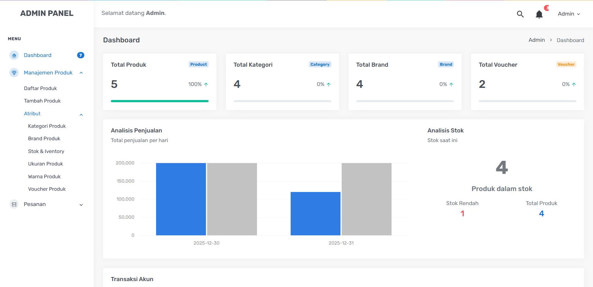

# E-Commerce Admin Panel

Admin Panel E-Commerce adalah sistem backend untuk mengelola seluruh operasional toko online seperti produk, kategori, brand, stok, voucher, dan pesanan. Sistem dirancang **cepat, interaktif, dan scalable** menggunakan Laravel + AJAX + DataTables.

---

## Dashboard

<p align="center">
  
</p>

Dashboard menampilkan ringkasan kondisi toko secara real-time.

### Fitur Dashboard

* Total Produk
* Total Kategori
* Total Brand
* Total Voucher
* Grafik Analisis Penjualan
* Monitoring Stok Produk
* Deteksi Stok Rendah
* Statistik Penjualan Harian

---

## Manajemen Produk

Admin dapat mengelola seluruh data produk dengan sistem terstruktur.

### Fitur Produk

* List Produk (Search, Sort, Pagination — DataTables)
* Tambah Produk
* Edit Produk
* Hapus Produk
* Upload Gambar Produk
* Harga & Stok
* Validasi Input

---

## Atribut Produk

Digunakan untuk pengelompokan dan struktur data produk.

### Kategori Produk

* CRUD Kategori
* Relasi ke Produk

### Brand Produk

* CRUD Brand
* Filter berdasarkan Brand

### Stok & Inventory

* Monitoring Stok Real-Time
* Deteksi Stok Rendah
* Update Stok Otomatis

### Ukuran Produk

* Multiple Size Support
* Relasi per Produk

### Warna Produk

* Multi Warna
* Kombinasi Produk

### Voucher Produk

* Diskon Persen / Nominal
* Validasi Masa Aktif
* Relasi ke Produk

---

## Manajemen Pesanan

Mengelola seluruh transaksi pembelian user dengan midtrans sebagai salah satu servicenya.

### Fitur Pesanan

* List Order (DataTables)
* Update Status Order
* Detail Order (AJAX Modal)

**Status Tracking:**

* Pending
* Paid
* Failed
* Shipped
* Cancelled

---

## Analisis Penjualan

Dashboard menyediakan grafik analitik untuk monitoring performa toko.

### Data Analitik

* Penjualan per Hari
* Total Revenue
* Produk Terjual
* Tren Penjualan

---

## Teknologi

* Laravel
* MySQL / MariaDB
* jQuery AJAX
* DataTables
* Bootstrap
* SweetAlert2
* Chart.js

---

## Instalasi

```bash
git clone https://github.com/Oracle4me/admin_page_ecommerce.git
cd project

composer install
cp .env.example .env
php artisan key:generate

php artisan migrate
php artisan serve
```

---

## 👨‍💻 Author

**Nur Muhammad Kevin**
Fullstack Developer — Laravel • Modular System • HMVC Architecture 
